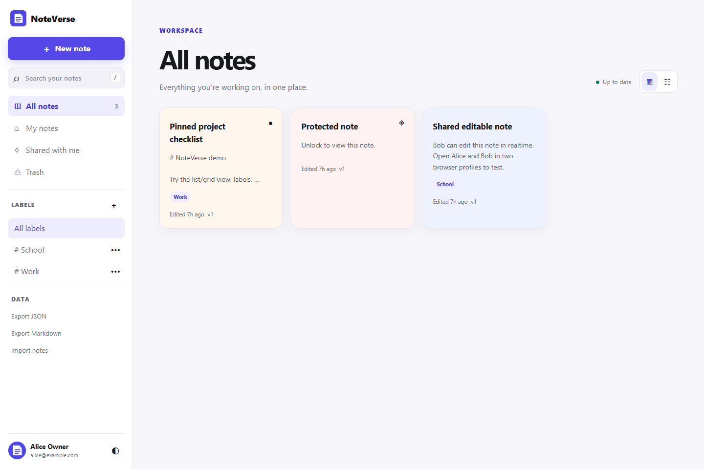
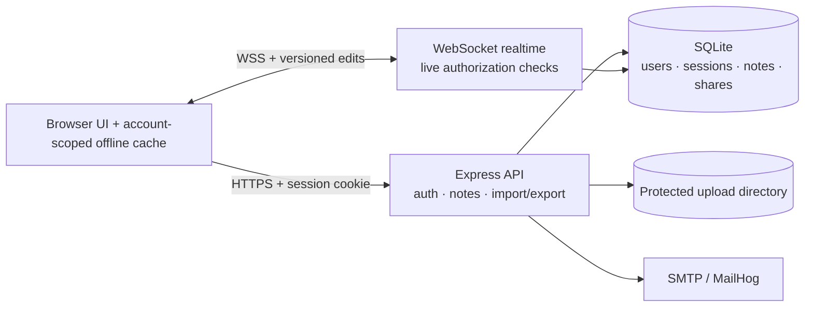

# NoteVerse

> A secure, offline-capable note workspace for writing, organizing, and collaborating without losing your place.

NoteVerse is a full-stack portfolio project built with Node.js, Express, SQLite, WebSocket, and browser-native JavaScript. It began as an academic project and is now maintained as a personal project focused on correctness, approachable UX, and explainable engineering choices.

Created and maintained by **Ngô Lâm Tiến**, Computer Science student at Ton Duc Thang University.



## What works today

- Registration, expiring email activation, login/logout, password reset, and password change
- Durable SQLite sessions, session fixation protection, password/session revocation, and authentication rate limits
- Create, autosave, search, pin, label, soft-delete, restore, and permanently delete notes
- Grid/list views, responsive navigation, light/dark themes, keyboard focus, and accessible labels
- Markdown editing with a safe preview, fenced code blocks, lists, links, and inline formatting
- Owner/editor/reader sharing with server-side authorization
- WebSocket collaboration that rechecks the live session, edit permission, lock state, and note version
- Password-protected notes across list/search, API, realtime, attachments, export, and offline cache
- Protected PNG/JPEG/GIF/WebP attachments with magic-byte checks, size limits, authorization-before-write, and orphan cleanup
- Account-scoped offline note snapshots and queued edits; logout purges the active account's local data
- Optimistic concurrency using note versions, with an explicit “server version / keep my draft” conflict UI
- JSON and Markdown export/import with validation and skip/copy/replace duplicate strategies
- PWA shell caching without caching private API responses
- Opt-in demo data, additive database migrations, Docker Compose, automated tests, linting, formatting, and CI

## Roadmap

The following are ideas, not shipped features:

- Note history beyond the current conflict recovery flow
- Full-text search and pagination for very large libraries
- Attachment bundles in export/import
- Multi-instance realtime fan-out through a shared broker
- Optional end-to-end encryption with a separately designed key model

## Technology

- Node.js 20 or 22, Express 4
- SQLite through `better-sqlite3`
- `express-session` with a project-local SQLite session store
- WebSocket through `ws`
- Vanilla JavaScript, HTML, CSS, Service Worker, and Web App Manifest
- Docker Compose and MailHog for local SMTP inspection
- Node's built-in test runner, ESLint, and Prettier



## Quick start with Docker Compose

Requirements: Docker Engine/Desktop with Docker Compose.

```powershell
cd src
Copy-Item .env.example .env
# Replace SESSION_SECRET in .env before using anything beyond local demo work.
docker compose up --build
```

Open NoteVerse at <http://localhost:8080> and MailHog at <http://localhost:8025>. The checked-in example explicitly sets `DEMO_MODE=true`; set it to `false` to start without demo users.

Stop the stack with `docker compose down`. The bind-mounted database and attachments remain under `src/app/data` and `src/app/uploads`.

## Quick start on Windows without Docker

Install Node.js 20.19+ or 22.x. For registration/activation, run an SMTP catcher such as MailHog on ports 1025/8025, or point the SMTP variables at a test SMTP service.

```powershell
cd src
Copy-Item .env.example .env
# Edit .env and set a private SESSION_SECRET.
cd app
npm ci
npm run start:env
```

Open <http://localhost:8080>. `npm start` also works when the environment variables are already set in your shell. In non-production mode, registration/reset responses include a development link so those flows remain testable when SMTP is intentionally disabled.

### Demo accounts

These users are created only when `DEMO_MODE=true` and only if they do not already exist:

| Walkthrough role | Email | Password |
| --- | --- | --- |
| Owner | `alice@example.com` | `123456` |
| Editor | `bob@example.com` | `123456` |
| Reader | `cara@example.com` | `123456` |

The preloaded protected note uses `note123`. Demo passwords intentionally do not satisfy the stronger rule for newly registered accounts; they are local walkthrough credentials, not production defaults.

## Configuration

`src/.env.example` documents every supported value. Production startup fails when `SESSION_SECRET` is shorter than 32 characters or SMTP is disabled, because new accounts would be unable to activate.

| Variable | Purpose | Typical local value |
| --- | --- | --- |
| `NODE_ENV` | Runtime mode | `development` |
| `PORT` | HTTP port | `8080` |
| `APP_BASE_URL` | Public origin used in links and origin validation | `http://localhost:8080` |
| `SESSION_SECRET` | Session signing secret; 32+ characters in production | required |
| `SESSION_HOURS` | Rolling session lifetime | `8` |
| `COOKIE_SECURE` | Send cookies over HTTPS only | `false` locally, `true` in production |
| `TRUST_PROXY` | Trust one reverse proxy hop | `false` |
| `DEMO_MODE` | Explicitly allow demo seeding | `true` for walkthrough only |
| `SMTP_ENABLED` | Enable outbound activation/reset/share messages | `true` |
| `SMTP_HOST`, `SMTP_PORT`, `SMTP_SECURE` | SMTP connection | `localhost`, `1025`, `false` |
| `SMTP_USER`, `SMTP_PASSWORD`, `MAIL_FROM` | SMTP credentials and sender | service-specific |
| `DATA_DIR`, `UPLOAD_DIR`, `DATABASE_PATH` | Optional storage overrides | project directories |
| `MAX_IMAGE_BYTES`, `MAX_IMAGES_PER_UPLOAD` | Upload limits | `5242880`, `8` |

When deployed behind HTTPS, set `APP_BASE_URL` to the exact public origin, `COOKIE_SECURE=true`, and `TRUST_PROXY=true` only if the platform terminates TLS at a trusted proxy.

## Database migrations and backup

Migrations run automatically and are additive. This release adds note versions, trash timestamps, lock versions, token expiry, session versions, and the sessions table. Existing notes, shares, labels, and upload paths remain valid.

Before upgrading an existing local database:

```powershell
cd src\app
Copy-Item data\noteverse.sqlite data\noteverse.backup.sqlite
Copy-Item uploads uploads-backup -Recurse
```

Stop the app before copying so the SQLite files are consistent. More detail is in [`docs/MIGRATIONS.md`](docs/MIGRATIONS.md).

## Test and quality commands

From `src/app`:

```powershell
npm ci
npm run lint
npm test
npm run format:check
npm audit
# Or run the repository gate:
npm run check
```

The integration suite uses temporary databases and uploads. It covers account activation, CSRF resistance, CRUD, owner/editor/reader authorization, cross-owner labels, lock access, authorized uploads, protected attachment reads, stale-version conflicts, active WebSocket permission revocation, trash/restore, import/export, Markdown XSS handling, and service-worker cache boundaries.

GitHub Actions runs the same gate on Node.js 20 and 22. This README intentionally shows no passing badge or coverage claim until results exist on the eventual public repository.

## Demo walkthrough

1. Sign in as Alice in one browser profile. Create a Markdown note, preview it, add a label, and share it with Bob as **Can edit** and Cara as **Read only**.
2. Sign in as Bob in another profile. Edit the shared note and watch Alice receive the update. In Alice's share control, downgrade or revoke Bob; his open WebSocket editor is closed immediately.
3. Sign in as Cara. The editor is read-only and API writes are rejected server-side.
4. To test offline edits, open an editable note, use browser DevTools to go offline, edit, and reconnect. The status changes from local draft to syncing/up to date.
5. To test a conflict, edit the same version in two profiles or reconnect a stale offline draft after another profile saves. NoteVerse keeps the local draft and asks whether to use the server version or keep the draft.
6. Move a note to Trash, restore it, then test JSON/Markdown export and import. Protected notes must be unlocked before export.

## Engineering decisions and limitations

- A note password is an authorization layer backed by bcrypt. It is deliberately not described as encryption or end-to-end encryption.
- Content is stored as Markdown source. Preview rendering escapes raw HTML and allows only safe link schemes.
- HTTP and WebSocket writes compare a `baseVersion`; stale writes return a conflict instead of silently overwriting newer text.
- Offline edits are namespaced by user ID and are retained on authorization/conflict failures. Only an explicit user choice removes a conflicted draft. Unlocked protected-note plaintext is never persisted in the offline cache; the UI keeps that draft in the open tab and asks the user to reconnect before leaving.
- Private API responses and attachment routes use `no-store`; the service worker caches only same-origin static shell assets.
- SQLite, the in-memory rate limiter, and in-process WebSocket rooms target a single application instance. Horizontal scaling needs a shared rate-limit/realtime backend.
- Offline mode edits already cached notes. Creating notes, changing sharing, uploading images, and account operations require a network connection.
- JSON/Markdown export currently contains text metadata, not attachment binaries.

For an interview-oriented explanation of save, authorization, realtime, and offline flows, see [`docs/ARCHITECTURE.md`](docs/ARCHITECTURE.md).

## Repository publishing checklist

The current history is preserved; no commit authorship was rewritten. Before publishing:

```powershell
git status --short
git diff --check
git diff
git add .
git commit -m "Upgrade NoteVerse security, offline sync, and portfolio UX"
git push origin main
```

Review the staged file list before committing. Never stage `src/.env`, personal databases, user uploads, `node_modules`, or backup files. This upgrade does not push, make the repository public, or deploy it automatically.

## License and third-party software

No project license has been assigned. That means normal copyright defaults apply even though the source is visible. MIT would be a reasonable future choice for a portfolio project because it is simple and permissive, but it should only be added after the maintainer explicitly chooses it.

Dependency and container attributions are preserved in [`THIRD_PARTY_NOTICES.md`](THIRD_PARTY_NOTICES.md) and their own packages/images. The earlier academic origin is acknowledged here without rewriting Git history or making claims about commit authorship.
